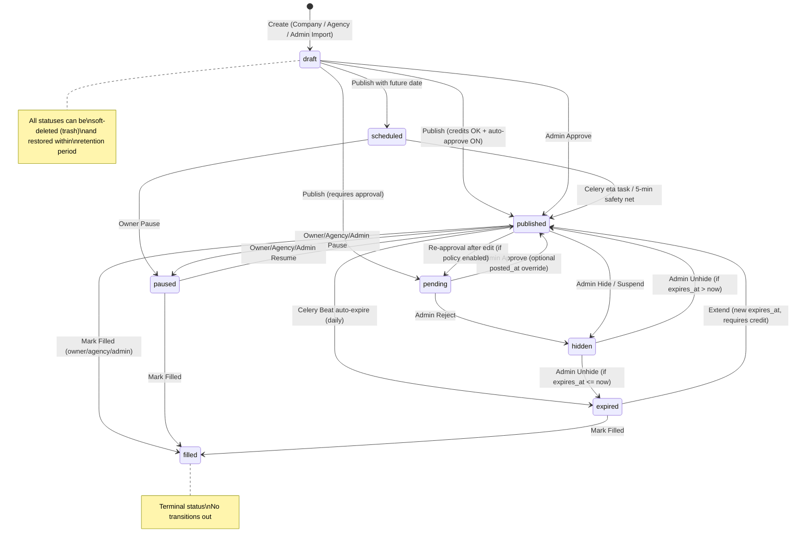

# Job Post Lifecycle Architecture

> **Document type**: Living architecture reference
> **Audience**: Backend engineers, frontend engineers, product managers, QA
> **Last updated**: 2026-02-19
> **Status**: Authoritative. All sections reflect the current codebase. All 14 TODOs resolved. All policy settings fully implemented and enforced.

---

## 1. Context

This document is the single source of truth for how a job posting moves through the Orion platform from creation to deletion. It covers every status, every transition, every automated task, and every billing interaction.

**Reference this document when:**

- Implementing or modifying any job status transition
- Building or debugging Celery tasks that touch jobs
- Adding billing gates or credit checks to the lifecycle
- Reviewing permission boundaries for company/agency/admin actions
- Planning frontend UI states for job management views

**Source files that define this lifecycle:**

| Layer | File | Concern |
|-------|------|---------|
| Model | `backend/apps/jobs/models.py` | Status choices, lifecycle methods (`publish`, `schedule`, `pause`, `expire`, `extend`, `mark_filled`) |
| Services | `backend/apps/jobs/services.py` | **JobPolicyService**: credit checks, approval logic, policy enforcement, validation helpers |
| Views | `backend/apps/jobs/views.py` | `CompanyJobViewSet`, `AgencyJobViewSet`, `AdminJobViewSet` |
| Tasks | `backend/apps/jobs/tasks.py` | Celery tasks: expire, schedule, purge, archive, alerts, cleanup |
| Serializers | `backend/apps/jobs/serializers.py` | Validation, field exposure, create/update logic |
| Billing | `backend/apps/billing/models.py` | Package, Entitlement, EntitlementLedger |
| Policy | `backend/apps/moderation/models.py` | PlatformSettings (singleton), PlatformSetting (KV) |
| Core Mixins | `backend/core/mixins.py` | `SoftDeleteMixin`, `SoftDeleteManager`, `TimestampMixin` |
| Scheduler | `backend/config/settings/base.py` | `CELERY_BEAT_SCHEDULE` |
| Frontend types | `lib/company/types.ts`, `lib/admin/types.ts` | TypeScript status enums and interfaces |

---

## 2. Status Definitions

| Status | DB Value | Meaning | Public | Owner | Admin |
|--------|----------|---------|--------|-------|-------|
| **Draft** | `draft` | Incomplete or unpublished. Default state on creation. | Hidden | Visible | Visible |
| **Pending Review** | `pending` | Submitted for admin approval. Routed here by approval policy or re-approval after edit. | Hidden | Read-only | Visible |
| **Pending Payment** | `pending_payment` | Publish attempted but no credits available. Awaiting package purchase. | Hidden | Visible | Visible |
| **Scheduled** | `scheduled` | Approved and waiting for `scheduled_publish_at`. Celery auto-publishes. | Hidden | Visible | Visible |
| **Published** | `published` | Live and active. Appears in public search if `expires_at > now`. | **Visible** | Visible | Visible |
| **Paused** | `paused` | Temporarily offline. Retains `posted_at` and `expires_at`. | Hidden | Visible | Visible |
| **Expired** | `expired` | Past its `expires_at`. Transitioned automatically by Celery. | Hidden | Visible | Visible |
| **Filled** | `filled` | Position closed/filled. Terminal status — no transition back. | Hidden | Visible | Visible |
| **Hidden** | `hidden` | Removed by admin moderation (reject, hide, suspend). | Hidden | Notified | Visible |

**Key nuances:**

- A `published` job is only "active" when `status == 'published' AND expires_at > timezone.now()`. The `is_active` model property encodes this.
- The public queryset (`PublicJobViewSet`) filters on both conditions.
- `hidden` serves double duty for rejected pending jobs and moderated published jobs.
- `filled` is a terminal status — no transitions out. Distinguishes "position closed" from "job expired".
- `pending_payment` signals a failed credit check — the client should redirect to billing.
- Default ordering is `['-featured', '-posted_at']` — featured jobs always surface first.
- Soft-deleted jobs (non-null `deleted_at`) are excluded by `SoftDeleteManager` default queryset. Admin uses `Job.all_objects` to see everything.

---

## 3. State Machine

### 3.1 Mermaid Diagram



### 3.2 Transition Matrix

| From | To | Company | Agency | Admin | Celery |
|------|-----|---------|--------|-------|--------|
| -- | `draft` | Create | Create (specify client company) | Bulk import | -- |
| `draft` | `published` | `publish()` (credits OK, auto-approve) | `publish()` (credits OK, auto-approve) | `approve()` | -- |
| `draft` | `pending` | `publish()` (requires approval) | `publish()` (requires approval) | -- | -- |
| `draft` | `scheduled` | `publish()` + `scheduled_publish_at` | `publish()` + `scheduled_publish_at` | -- | -- |
| `pending_payment` | `published` | `publish()` after purchase | `publish()` after purchase | -- | -- |
| `pending` | `published` | -- | -- | `approve()` | -- |
| `pending` | `hidden` | -- | -- | `reject()` | -- |
| `scheduled` | `published` | -- | -- | -- | `publish_scheduled_job` / `publish_due_scheduled_jobs` |
| `scheduled` | `paused` | `pause()` | `pause()` | -- | -- |
| `published` | `paused` | `pause()` | `pause()` | `pause()` | -- |
| `published` | `expired` | -- | -- | -- | `expire_jobs` (daily) |
| `published` | `hidden` | -- | -- | `hide()` / `reject()` | -- |
| `published` | `filled` | `mark_filled()` | `mark_filled()` | `mark_filled()` | -- |
| `published` | `pending` | -- (auto, on edit) | -- | -- | -- |
| `paused` | `published` | `resume()` | `resume()` | `resume()` | -- |
| `paused` | `filled` | `mark_filled()` | `mark_filled()` | `mark_filled()` | -- |
| `expired` | `published` | `extend()` | `extend()` | `extend()` | -- |
| `expired` | `filled` | `mark_filled()` | `mark_filled()` | `mark_filled()` | -- |
| `hidden` | `published`/`expired` | -- | -- | `unhide()` | -- |
| Any | **Trashed** | `trash()` | `trash()` | `trash()` / `bulk_action(delete)` | -- |
| Trashed | Restored | `restore()` | `restore()` | `restore()` / `bulk_action(restore)` | -- |
| Trashed | **Hard deleted** | -- | -- | `bulk_action(permanent_delete)` | `purge_trashed_jobs` (daily, after retention) |

> **Note:** All lifecycle actions are available to Company, Agency, and Admin users. Credit consumption is enforced at publish, extend, and feature actions for Company and Agency (not Admin).

---

## 4. Lifecycle Phases

### 4.1 Creation & Drafting

**Entry points:**

| Endpoint | Actor | Notes |
|----------|-------|-------|
| `POST /api/jobs/company/` | Company employer | `company` auto-set from `request.user.company` |
| `POST /api/jobs/agency/` | Agency user | Must provide `company_id`; validated against active `AgencyClient` |
| `POST /api/admin/jobs/bulk-import/` | Platform admin | Company mode (one company) or Agency mode (per-job `company_name`) |

A new job is always created in `draft` status. The serializer sets a default `expires_at = now + 30 days` (this gets recalculated at publish time based on the entity's entitlement).

**Duplicate:** `POST /api/jobs/company/{id}/duplicate/` creates a copy with `status='draft'`, `title = "Original (Copy)"`, stripped of dates and metrics.

**Slug generation:** Auto-generated on save from `{title}-{company_name}` with collision counter (e.g., `senior-dev-acme`, `senior-dev-acme-1`).

### 4.2 Review & Approval

**Current state: FULLY IMPLEMENTED.** Jobs transition to `pending` when the approval policy requires it. The `requires_approval(company)` service function (in `services.py`) evaluates the company's verification status against platform policy settings.

**Approval policy (enforced):**

| Setting | Default | Effect | Enforced |
|---------|---------|--------|----------|
| `job_auto_approve_verified` | `True` | Verified companies skip review | **YES** |
| `require_approval_for_new_companies` | `True` | New companies' first jobs route to `pending` | **YES** |
| `require_approval_for_unverified` | `True` | Unverified companies' jobs route to `pending` | **YES** |

**Implementation:** `requires_approval(company)` in `services.py` reads `PlatformSettings.job_auto_approve_verified` and `job_policy` KV settings. Called in `CompanyJobViewSet.publish()` and `AgencyJobViewSet.publish()`.

**Re-approval after editing:** When `require_reapproval_on_edit` policy is enabled, editing a published job's title, description, or requirements automatically reverts it to `pending`. Checked in `CompanyJobViewSet.perform_update()`.

**Admin approval (implemented):**

```
AdminJobViewSet.approve()
    Guards: status in ['pending', 'draft']
    Optional: posted_at override (admin can backdate to any past date)
    Reads: duration from get_package_duration(entity) (entitlement or platform default)
    Sets: status='published', posted_at, expires_at = posted_at + duration
```

**Admin rejection (implemented):**

```
AdminJobViewSet.reject()
    No status guard (any job can be rejected)
    Sets: status='hidden'
```

### 4.3 Scheduling & Publishing

**Immediate publish:**

```
CompanyJobViewSet.publish() / AgencyJobViewSet.publish()
    Guards: status in ['draft', 'paused', 'scheduled', 'pending_payment']
    Policy: validate_max_active_jobs(company) — enforces cap
    Credit: consume_credit(entity, job, 'job_post') — returns entitlement or raises InsufficientCreditsError (HTTP 402)
    Approval: requires_approval(company) — if True, sets status='pending' and returns (skips publish)
    Duration: entitlement.post_duration_days (from consume_credit result)
    Calls: job.publish(duration_days=duration)
    Result: status='published', posted_at=now, expires_at=now+duration
```

**Scheduled publish:**

```
CompanyJobViewSet.publish() / AgencyJobViewSet.publish() with scheduled_publish_at
    Same credit + approval checks as immediate publish
    Validates: scheduled date is in the future
    Calls: job.schedule(publish_at, duration_days)
    Result: status='scheduled', scheduled_publish_at=date, expires_at=date+duration
    Dispatches: publish_scheduled_job.apply_async(args=[job.id], eta=publish_at)
```

**Celery auto-publish (dual mechanism):**

1. **Eta task** — `publish_scheduled_job(job_id)`: Fires at the exact scheduled time. Sets `posted_at = scheduled_publish_at`, clears `scheduled_publish_at`.
2. **Safety net** — `publish_due_scheduled_jobs()`: Runs every 5 minutes via Beat. Catches scheduled jobs where `scheduled_publish_at <= now` (handles missed eta tasks from worker restarts, Redis flushes, etc.).

### 4.4 Active Period (Published)

While published and not expired:

- Appears in public search via `PublicJobViewSet` (filters: `status='published', expires_at__gt=now`)
- View tracking: per-visitor 24-hour dedup via `JobView` records, atomic counter increments via `F()` expressions
- Applications accumulate, update `applications_count`
- Ordering: `[-featured, -posted_at]` (featured always first)

**`is_active` property:** Returns `self.status == 'published' and self.expires_at > timezone.now()`

### 4.5 Pause & Resume

**Pause:**

| Actor | Allowed from | Endpoint |
|-------|-------------|----------|
| Company | `published`, `scheduled` | `POST /api/jobs/company/{id}/pause/` |
| Agency | `published`, `scheduled` | `POST /api/jobs/agency/{id}/pause/` |
| Admin | `published` only | `POST /api/admin/jobs/{id}/pause/` |

Calls `job.pause()` — sets `status='paused'`, preserves all dates.

**Resume:**

| Actor | Allowed from | Endpoint |
|-------|-------------|----------|
| Company | `paused` | `POST /api/jobs/company/{id}/resume/` |
| Agency | `paused` | `POST /api/jobs/agency/{id}/resume/` |
| Admin | `paused` | `POST /api/admin/jobs/{id}/resume/` |

Sets `status='published'` directly. **Preserves existing `posted_at` and `expires_at`** — the expiration clock does not pause.

**Design decision:** Pausing does NOT stop the expiration clock. A job paused for 10 days loses 10 days of active visibility. This prevents indefinite free job duration through pause/resume cycles.

### 4.6 Expiry & Extension

**Auto-expiry (Celery Beat — daily):**

```
expire_jobs()
    Bulk updates: Job.objects.filter(status='published', expires_at__lt=now)
    Sets: status='expired', closed_at=now
```

**Extension (Company / Agency — requires 1 job post credit):**

```
CompanyJobViewSet.extend() / AgencyJobViewSet.extend()
    Credit: consume_credit(entity, job, 'job_post') — returns HTTP 402 if no credits
    Accepts: days (int, default 30)
    Calls: job.extend(days) — sets expires_at = now + days
    If status was 'expired': transitions back to 'published'
```

**Extension (Admin — no credit check):**

```
AdminJobViewSet.extend()
    Accepts: expires_at (absolute date string) OR days (int)
    If expires_at provided: sets directly, transitions expired -> published
    If days provided: delegates to job.extend()
```

### 4.7 Moderation (Hide / Unhide / Reject)

**Hide / Reject:**

```
AdminJobViewSet.hide()    → status='hidden' (no status guard)
AdminJobViewSet.reject()  → status='hidden' (same as hide)
```

**Unhide:**

```
AdminJobViewSet.unhide()
    Guards: status must be 'hidden'
    If expires_at > now: status='published'
    If expires_at <= now: status='expired'
```

**Bulk moderation:**

```
AdminJobViewSet.bulk_action()
    Actions: approve, reject, hide, pause, resume, feature, unfeature, delete, restore, permanent_delete
    'delete' is SOFT DELETE — sets deleted_at timestamp (moves to trash)
    'restore' clears deleted_at (recovers from trash)
    'permanent_delete' is HARD DELETE — only works on already-trashed jobs (deleted_at IS NOT NULL)
```

### 4.8 Archival & Deletion

**Current state: FULLY IMPLEMENTED.**

#### Soft Delete (Trash)

- **Model:** `Job` uses `SoftDeleteMixin` from `core.mixins`, which adds a `deleted_at` field and `delete()`, `restore()`, `hard_delete()` methods.
- **Manager:** `Job.objects` is `SoftDeleteManager` (excludes soft-deleted by default). `Job.all_objects` includes deleted records.
- **Trash actions:**
  - Company: `POST /api/jobs/company/{id}/trash/` (soft-delete), `POST /api/jobs/company/{id}/restore/`, `GET /api/jobs/company/trash/` (list)
  - Agency: `POST /api/jobs/agency/{id}/trash/`, `POST /api/jobs/agency/{id}/restore/`
  - Admin: `POST /api/admin/jobs/{id}/trash/`, `POST /api/admin/jobs/{id}/restore/`, `GET /api/admin/jobs/trash/` (list)
- **Bulk actions:** `delete` = soft delete, `restore` = restore, `permanent_delete` = hard delete (trashed jobs only)

#### Trash Retention & Purge

- **Celery task:** `purge_trashed_jobs()` runs **daily** via Beat schedule
- **Policy setting:** `trash_retention_days` (default: 30) in `job_policy` KV store
- **Behavior:** Hard-deletes jobs where `deleted_at < now - retention_days`

#### Expired Job Archival

- **Celery task:** `archive_expired_jobs()` runs **daily** via Beat schedule
- **Policy setting:** `expired_retention_days` (default: 0 = disabled) in `job_policy` KV store
- **Behavior:** Soft-deletes (moves to trash) expired jobs where `closed_at < now - retention_days`

#### Mark Filled (Terminal Status)

- `mark_filled()` available on Company, Agency, and Admin ViewSets
- Allowed from: `published`, `paused`, `expired`
- Sets `status='filled'` and `closed_at=now` — no transition back

---

## 5. Billing Integration

### 5.1 Data Model

```
Package                         Entitlement                      EntitlementLedger
├── name, slug, price           ├── company (FK)                 ├── entitlement (FK)
├── package_type                ├── agency (FK)                  ├── change (+/-)
│   (one_time|bundle|sub)       ├── package (FK)                 ├── reason
├── credits (job posts)         ├── credits_total / credits_used ├── job (FK)
├── post_duration_days          ├── featured_credits_total/used  ├── admin (FK)
├── featured_credits            ├── social_credits_total/used    ├── notes
├── social_credits              ├── post_duration_days           └── created_at
├── stripe_product_id           ├── expires_at
├── stripe_price_id             ├── source (purchase|grant|sub|promo|refund)
└── team_management             └── source_reference
```

### 5.2 Purchase Flow

```
User selects package → Stripe Checkout → Webhook: checkout.session.completed
    → handle_checkout_completed():
        1. Creates Invoice (status='paid')
        2. Creates Entitlement (credits_total = package.credits * qty)
        3. Creates InvoiceItem line items
        4. Generates PDF invoice
```

### 5.3 Credit Consumption

**Credit enforcement is FULLY IMPLEMENTED across all lifecycle actions.**

**Service function:** `consume_credit(entity, job, credit_type, admin=None)` in `services.py`

**Behavior:**
1. Finds active entitlement with remaining credits via `get_active_entitlement(entity, credit_type)`
2. Increments `credits_used`, `featured_credits_used`, or `social_credits_used` depending on `credit_type`
3. Creates `EntitlementLedger` entry (audit trail)
4. Returns the entitlement (used to read `post_duration_days`)
5. Raises `InsufficientCreditsError` if no valid entitlement found — ViewSets return HTTP 402

| Action | Credit Type | Enforcement | Called In |
|--------|------------|-------------|-----------|
| Publish a job | Job post (1 credit) | **IMPLEMENTED** | `CompanyJobViewSet.publish()`, `AgencyJobViewSet.publish()` |
| Extend a job | Job post (1 credit) | **IMPLEMENTED** | `CompanyJobViewSet.extend()`, `AgencyJobViewSet.extend()` |
| Feature a job | Featured (1 credit) | **IMPLEMENTED** | `CompanyJobViewSet.feature()`, `AgencyJobViewSet.feature()` |
| Social distribution | Social credit | **IMPLEMENTED** | Handled in `apps.social` (separate app) |

**Note:** Admin actions (approve, extend, feature) do **not** consume credits — admin overrides billing.

### 5.4 Duration Lookup

**Implementation:** `get_package_duration(entity)` in `services.py`

```python
def get_package_duration(entity):
    entitlement = get_active_entitlement(entity, 'job_post')
    if entitlement:
        return entitlement.post_duration_days
    settings = get_platform_settings()
    return settings.job_default_duration_days
```

**Behavior:**
- Delegates to `get_active_entitlement(entity, 'job_post')` which queries for non-expired entitlements with remaining credits
- Returns `entitlement.post_duration_days` if found
- Fallback: reads `PlatformSettings.job_default_duration_days` (typically 30)

**Usage:**
- `AdminJobViewSet.approve()` calls `get_package_duration(entity)` to calculate expiry date
- Company/Agency publish flows get duration from the entitlement returned by `consume_credit()` (same underlying lookup)

---

## 6. Platform Policy Engine

### 6.1 Storage

Platform-wide job settings are stored in two locations:

1. **`PlatformSetting`** (KV store) — `key='job_policy'`, `value=JSON`. Read/written via `GET/PATCH /api/admin/jobs/policy/`.
2. **`PlatformSettings`** (singleton model, pk=1) — Strongly typed fields. Read via `PlatformSettings.get_settings()`.

### 6.2 Job Policy Settings

| Setting | Type | Default | Intended Effect | Enforced | Implementation |
|---------|------|---------|-----------------|----------|----------------|
| `job_auto_approve_verified` | bool | `True` | Verified companies skip `pending` | **YES** | `requires_approval()` in `services.py` |
| `require_approval_for_new_companies` | bool | `True` | First-time companies need admin approval | **YES** | `requires_approval()` |
| `require_approval_for_unverified` | bool | `True` | Unverified companies need admin approval | **YES** | `requires_approval()` |
| `max_active_jobs_per_company` | int | `50` | Cap concurrent published jobs | **YES** | `validate_max_active_jobs()` in publish action |
| `salary_required` | bool | `False` | Require salary range on submissions | **YES** | `validate_salary_required()` in `perform_create` |
| `prohibited_keywords` | list | Scam terms | Block submissions with these keywords | **YES** | `validate_prohibited_keywords()` in `perform_create` |
| `require_reapproval_on_edit` | bool | `False` | Revert to `pending` after editing critical fields | **YES** | `requires_reapproval_on_edit()` in `perform_update` |
| `lock_editing_after_publish` | bool | `False` | Prevent editing published jobs | **YES** | `can_edit_published_job()` + per-company override |
| `expired_retention_days` | int | `0` | Auto-archive expired jobs after N days (0 = disabled) | **YES** | `archive_expired_jobs()` Celery task |
| `trash_retention_days` | int | `30` | Hard-delete trashed jobs after N days | **YES** | `purge_trashed_jobs()` Celery task |
| `allowed_categories` | list | `[]` | Restrict allowed job categories | **YES** | `validate_allowed_categories()` — checked in `perform_create()` for Company + Agency |
| `default_post_duration` | int | `30` | Days a job stays published | **YES** | `get_package_duration()` fallback to `PlatformSettings.job_default_duration_days` |
| `job_max_duration_days` | int | `90` | Maximum allowed post duration | **YES** | `validate_max_duration()` — checked in `publish()` for Company + Agency |
| `auto_expire_enabled` | bool | `True` | Whether expire task runs | **YES** | `expire_jobs()` task checks policy; returns early if disabled |
| `external_url_validation` | bool | `True` | Validate external apply URLs | **YES** | `validate_external_url()` in `services.py` — domain blocklist + HEAD reachability check; wired in Company + Agency `perform_create()` |
| `job_enable_refresh` | bool | `True` | Allow employers to bump a job | **YES** | `validate_refresh_allowed()` + `Job.refresh()` — Company + Agency `refresh` actions; consumes 1 credit; configurable cooldown |
| `job_enable_spam_detection` | bool | `True` | Run spam detection on new jobs | **YES** | `run_spam_detection()` — rule-based scoring (CAPS, punctuation, salary, patterns, FraudRule); auto-hold above threshold; wired in `perform_create()` |
| `job_block_duplicates` | bool | `True` | Prevent duplicate job postings | **YES** | `check_for_duplicates()` — `title__iexact` same company, active statuses; blocks in `perform_create()` |

**Summary:** All policy settings are **fully enforced** via `JobPolicyService` in `services.py`. The admin policy endpoint merges PlatformSettings booleans with KV store settings transparently.

---

## 7. Permission Matrix

### 7.1 Job Actions by Role

| Action | Public | Candidate | Company | Agency | Admin |
|--------|--------|-----------|---------|--------|-------|
| View published jobs | Yes | Yes | Yes | Yes | Yes |
| View own draft/pending/etc. | -- | -- | Own | Client jobs | All (incl. deleted) |
| Create job | -- | -- | Yes | Yes (must specify client) | Bulk import |
| Edit draft | -- | -- | Yes | Yes | Yes |
| Edit published | -- | -- | Yes (policy-gated) | Yes (policy-gated) | Yes |
| Publish immediately | -- | -- | Yes (credit required) | Yes (credit required) | Via approve |
| Schedule for future | -- | -- | Yes | Yes | -- |
| Pause | -- | -- | Yes | Yes | Yes |
| Resume | -- | -- | Yes | Yes | Yes |
| Extend expiry | -- | -- | Yes (credit required) | Yes (credit required) | Yes (no credit check) |
| Toggle featured | -- | -- | Yes (featured credit) | Yes (featured credit) | Yes (no credit check) |
| Duplicate | -- | -- | Yes | Yes | -- |
| Mark filled | -- | -- | Yes | Yes | Yes |
| Soft delete (trash) | -- | -- | Yes | Yes | Yes |
| Restore from trash | -- | -- | Yes | Yes | Yes |
| View trash | -- | -- | Yes | -- | Yes |
| Approve | -- | -- | -- | -- | Yes |
| Reject | -- | -- | -- | -- | Yes |
| Hide / Suspend | -- | -- | -- | -- | Yes |
| Unhide | -- | -- | -- | -- | Yes |
| Bulk actions (12 types) | -- | -- | -- | -- | Yes |
| Export CSV/XLSX | -- | -- | -- | -- | Yes |
| Hard delete (trashed only) | -- | -- | -- | -- | Yes |
| View stats | -- | -- | Own | Own | All |
| View analytics (time-series) | -- | -- | Own | -- | -- |
| Report a job | Yes | Yes | Yes | Yes | -- |

### 7.2 Backend Permission Classes

| ViewSet | Permissions |
|---------|------------|
| `PublicJobViewSet` | `AllowAny` |
| `CompanyJobViewSet` | `IsAuthenticated`, `IsEmployer` |
| `AgencyJobViewSet` | `IsAuthenticated`, `IsAgency` |
| `AdminJobViewSet` | `IsAuthenticated`, `IsAdmin` |

---

## 8. Celery Task Map

### 8.1 Beat-Scheduled (Periodic)

| Task | Schedule | Purpose |
|------|----------|---------|
| `apps.jobs.tasks.expire_jobs` | Every 24 hours | Bulk-update `published` jobs past `expires_at` to `expired` |
| `apps.jobs.tasks.publish_due_scheduled_jobs` | Every 5 minutes | Safety net: publish overdue `scheduled` jobs |
| `apps.jobs.tasks.purge_trashed_jobs` | Every 24 hours | Permanently delete trashed jobs past `trash_retention_days` policy |
| `apps.jobs.tasks.archive_expired_jobs` | Every 24 hours | Soft-delete expired jobs past `expired_retention_days` policy |
| `apps.jobs.tasks.cleanup_old_job_views` | Every 7 days | Purge `JobView` records older than 90 days |
| `apps.jobs.tasks.send_job_alerts` (daily) | Every 24 hours | Send daily candidate alert emails |
| `apps.jobs.tasks.send_job_alerts` (weekly) | Every 7 days | Send weekly candidate alert emails |
| `apps.jobs.tasks.update_job_metrics` | Every 1 hour | Recalculate `views`, `unique_views`, `applications_count`, `report_count` from source tables |

### 8.2 Eta-Dispatched (One-Shot)

| Task | Trigger | Purpose |
|------|---------|---------|
| `publish_scheduled_job(job_id)` | `CompanyJobViewSet.publish()` with `scheduled_publish_at` | Publish a specific job at its exact scheduled time |

### 8.3 Related Non-Job Tasks

| Task | Schedule | Purpose |
|------|----------|---------|
| `apps.social.tasks.process_scheduled_posts` | Every minute | Process scheduled social media posts |
| `apps.social.tasks.cleanup_old_pending_posts` | Daily 3:00 AM | Clean up stale pending social posts |
| `apps.audit.tasks.cleanup_old_login_attempts` | Every 24 hours | GDPR compliance: purge old login attempts |
| `apps.moderation.tasks.run_fraud_scan` | Every 15 minutes | Run fraud detection rules |

---

## 9. Date Field Reference

| Field | Type | Set When | Nullable | Meaning |
|-------|------|----------|----------|---------|
| `created_at` | `auto_now_add` | Record inserted | No | When the job was first created |
| `updated_at` | `auto_now` | Any save | No | When the job was last modified |
| `posted_at` | `DateTimeField` | On publish / admin approve | Yes (null until published) | When the job became publicly visible. Backdatable by admin. |
| `expires_at` | `DateTimeField` | On create (default), recalculated on publish/extend | No (required) | When the job auto-expires. `posted_at + duration_days` at publish. |
| `closed_at` | `DateTimeField` | On expire or mark_filled | Yes | When the job was closed. Set by `expire()` and `mark_filled()` methods. |
| `scheduled_publish_at` | `DateTimeField` | On schedule | Yes | Target datetime for Celery auto-publish. Cleared to `null` once published. |
| `deleted_at` | `DateTimeField` | On soft delete (trash) | Yes | When the job was moved to trash. `null` = active record. Provided by `SoftDeleteMixin`. |

### Date Lifecycle Example

```
1. Create:      created_at = now
                expires_at = now + 30d (serializer default, recalculated at publish)
                posted_at = NULL

2. Publish:     posted_at = now (or admin override)
                expires_at = posted_at + entitlement.post_duration_days

3. Auto-expire: closed_at = now
                status = 'expired'

4. Extend:      expires_at = new_date (admin) or now + days (company)
                status = 'published' (if was expired)
                closed_at unchanged

5. Mark filled: closed_at = now
                status = 'filled' (terminal)

6. Trash:       deleted_at = now
                (all other dates preserved)

7. Restore:     deleted_at = NULL
                status returns to pre-trash value
```

---

## 10. Implementation Status

### 10.1 Status Transitions

| Transition | Status |
|-----------|--------|
| `draft` -> `published` (immediate publish) | **IMPLEMENTED** |
| `draft` -> `scheduled` (future publish) | **IMPLEMENTED** |
| `draft` -> `pending` (approval required) | **IMPLEMENTED** — `requires_approval()` in `JobPolicyService` |
| `pending` -> `published` (admin approve) | **IMPLEMENTED** |
| `pending` -> `hidden` (admin reject) | **IMPLEMENTED** |
| `scheduled` -> `published` (auto) | **IMPLEMENTED** — Celery eta + 5-min safety net |
| `published` -> `paused` (company/admin) | **IMPLEMENTED** |
| `paused` -> `published` (resume) | **IMPLEMENTED** |
| `published` -> `expired` (auto) | **IMPLEMENTED** — `expire_jobs` Celery Beat |
| `expired` -> `published` (extend) | **IMPLEMENTED** |
| `published` -> `hidden` (admin) | **IMPLEMENTED** |
| `hidden` -> `published`/`expired` (unhide) | **IMPLEMENTED** |

### 10.2 Features

| Feature | Status | Notes |
|---------|--------|-------|
| Company CRUD + all lifecycle actions | **IMPLEMENTED** | publish, pause, resume, extend, feature, duplicate |
| Agency CRUD | **IMPLEMENTED** | Create, read, update, delete |
| Agency lifecycle actions | **IMPLEMENTED** | publish, pause, resume, extend, feature, duplicate, mark_filled, trash, restore on `AgencyJobViewSet` |
| Admin approve/reject/hide/unhide/pause/resume/extend/feature | **IMPLEMENTED** | Full admin toolkit |
| Admin bulk actions (12 types) | **IMPLEMENTED** | approve, reject, hide, pause, resume, feature, unfeature, delete, restore, permanent_delete, mark_filled, export |
| Admin bulk import | **IMPLEMENTED** | Company mode + Agency mode with auto-create companies |
| Admin CSV/XLSX export | **IMPLEMENTED** | Filterable, configurable fields |
| Credit deduction at publish | **IMPLEMENTED** | `consume_credit()` called in publish flow; returns 402 if no credits |
| Credit deduction at extend | **IMPLEMENTED** | Extension consumes 1 job post credit |
| Featured credit deduction | **IMPLEMENTED** | Enabling featured consumes 1 featured credit |
| Policy enforcement (auto-approve, max jobs, keywords, etc.) | **IMPLEMENTED** | `JobPolicyService` reads PlatformSettings + job_policy KV; enforced in views |
| Soft delete / trash | **IMPLEMENTED** | `SoftDeleteMixin` on Job model; trash/restore actions; `purge_trashed_jobs` Celery task |
| Job archival / expired purge | **IMPLEMENTED** | `archive_expired_jobs` Celery task with configurable `expired_retention_days` |
| Re-approval after editing published job | **IMPLEMENTED** | `require_reapproval_on_edit` policy setting; reverts to `pending` on critical field edits |
| Per-company editing restrictions | **IMPLEMENTED** | `lock_editing_after_publish` platform toggle + `editing_locked_after_publish` per-company override on Company model |
| `cleanup_old_job_views` scheduling | **IMPLEMENTED** | Added to Celery Beat schedule (weekly) |
| `update_job_metrics` task | **IMPLEMENTED** | Recalculates views/unique_views/applications_count/report_count from source tables hourly |
| `filled` terminal status | **IMPLEMENTED** | `mark_filled()` method + action on all ViewSets |
| Job edit audit trail | **IMPLEMENTED** | Before/after snapshots via `create_audit_log()` in `perform_update()` for Company + Agency |
| Preview mode | **NOT NEEDED** — frontend-only concern (render draft with public layout) |

---

## 11. Architecture TODOs

Prioritized by business impact and risk.

### P0 — Critical (Revenue & Data Integrity)

#### ~~TODO-1: Implement credit deduction at publish~~ ✅ DONE

- **Implemented in:** `backend/apps/jobs/services.py` (`consume_credit()`), `CompanyJobViewSet.publish()`, `AgencyJobViewSet.publish()`
- Returns 402 if no credits available. `pending_payment` status added to `STATUS_CHOICES`.

#### ~~TODO-2: Implement credit deduction at extend~~ ✅ DONE

- **Implemented in:** `CompanyJobViewSet.extend()`, `AgencyJobViewSet.extend()`
- Extensions consume 1 job post credit. Returns 402 if none available.

#### ~~TODO-3: Implement featured credit deduction~~ ✅ DONE

- **Implemented in:** `CompanyJobViewSet.feature()`, `AgencyJobViewSet.feature()`
- Enabling featured consumes 1 featured credit. Disabling is free.

### P1 — High (Platform Integrity)

#### ~~TODO-4: Enforce platform policy settings~~ ✅ DONE

- **Implemented in:** `backend/apps/jobs/services.py` (`JobPolicyService` functions)
- Enforces: auto-approve gating, max active jobs, prohibited keywords, salary requirement.
- Views call service functions at create and publish time.

#### ~~TODO-5: Implement `draft` -> `pending` transition~~ ✅ DONE

- **Implemented in:** `CompanyJobViewSet.publish()`, `AgencyJobViewSet.publish()`
- `requires_approval(company)` checks `job_auto_approve_verified`, company status, and policy settings.

#### ~~TODO-6: Add Agency lifecycle actions~~ ✅ DONE

- **Implemented in:** `AgencyJobViewSet`
- Full lifecycle: publish, pause, resume, extend, feature, duplicate, mark_filled, trash, restore, stats.

#### ~~TODO-7: Implement soft delete with trash~~ ✅ DONE

- **Implemented in:** Job model uses `SoftDeleteMixin` + `SoftDeleteManager` from `core.mixins`
- `deleted_at` field, trash/restore actions on all ViewSets, `purge_trashed_jobs` Celery task (configurable retention).

### P2 — Medium (Operational Quality)

#### ~~TODO-8: Schedule `cleanup_old_job_views` task~~ ✅ DONE

- **Implemented in:** `backend/config/settings/base.py` `CELERY_BEAT_SCHEDULE`
- Added on weekly schedule (`60 * 60 * 24 * 7`). Task already existed in `tasks.py`.

#### ~~TODO-9: Implement `update_job_metrics` task~~ ✅ DONE

- **Implemented in:** `backend/apps/jobs/tasks.py` (`update_job_metrics()`)
- Recalculates `views`, `unique_views`, `applications_count`, `report_count` from `JobView`, `Application`, and `JobReport` source tables using annotated querysets. Only writes when values have drifted. Runs hourly via Celery Beat.

#### ~~TODO-10: Add re-approval after editing published jobs~~ ✅ DONE

- **Implemented in:** `backend/apps/jobs/services.py` (`requires_reapproval_on_edit()`), `CompanyJobViewSet.perform_update()`
- `require_reapproval_on_edit` policy setting. When enabled, editing title/description/requirements on a published job reverts it to `pending`.

#### ~~TODO-11: Add per-company editing restrictions~~ ✅ DONE

- **Implemented in:** `backend/apps/companies/models.py` (`editing_locked_after_publish` field), `backend/apps/jobs/services.py` (`can_edit_published_job()`), `CompanyJobViewSet.perform_update()`
- Platform-wide `lock_editing_after_publish` toggle + per-company `editing_locked_after_publish` BooleanField (None = use platform default). Returns 403 when editing is locked.

### P3 — Low (Completeness)

#### ~~TODO-12: Add `filled` terminal status~~ ✅ DONE

- **Implemented in:** `Job.STATUS_CHOICES`, `Job.mark_filled()` method, `mark_filled` action on CompanyJobViewSet, AgencyJobViewSet, AdminJobViewSet
- Terminal status — no transition back. Sets `closed_at` timestamp.

#### ~~TODO-13: Add job edit audit trail~~ ✅ DONE

- **Implemented in:** `CompanyJobViewSet.perform_update()` and `AgencyJobViewSet.perform_update()` in `backend/apps/jobs/views.py`
- Captures before/after snapshots of all changed fields. Writes `AuditLog` entries via `create_audit_log()` with action='update', including IP address and user agent from the request.

#### ~~TODO-14: Add expired job archival~~ ✅ DONE

- **Implemented in:** `backend/apps/jobs/tasks.py` (`archive_expired_jobs` Celery task), scheduled daily in Celery Beat
- Reads `expired_retention_days` from job policy settings (default 180). Soft-deletes expired jobs past the retention cutoff.

---

## Appendix A: Database Indexes

| Index | Fields | Optimizes |
|-------|--------|-----------|
| `jobs_status_posted_at` | `[status, posted_at]` | Public job listing (published, sorted by date) |
| `jobs_company_status` | `[company, status]` | Company dashboard filtering |
| `jobs_category_status` | `[category, status]` | Category-based search |
| `jobs_location_type_status` | `[location_type, status]` | Location type filtering |
| `jobs_expires_at` | `[expires_at]` | Expiry task query |
| `jobs_featured_status` | `[featured, status]` | Featured job listing |
| `jobs_status_scheduled` | `[status, scheduled_publish_at]` | Scheduled publish safety net query |
| `jobs_deleted_at` | `[deleted_at]` | Soft-delete / trash queries |

---

## Appendix B: Frontend Type Alignment

The frontend `JobStatus` type must stay in sync with backend `Job.STATUS_CHOICES`:

```typescript
// lib/company/types.ts
export type JobStatus = 'draft' | 'pending' | 'pending_payment' | 'scheduled' | 'published' | 'paused' | 'expired' | 'filled' | 'hidden'

// lib/admin/types.ts
export type AdminJobStatus = 'draft' | 'pending' | 'pending_payment' | 'scheduled' | 'published' | 'paused' | 'expired' | 'filled' | 'hidden'
```

Any new statuses must be added to:

1. `backend/apps/jobs/models.py` — `Job.STATUS_CHOICES`
2. `lib/company/types.ts` — `JobStatus`
3. `lib/admin/types.ts` — `AdminJobStatus`
4. Database migration for the new choice value
5. Frontend status config maps (colors, icons, labels) in admin and company pages

---

## Appendix C: API Endpoint Reference

| Endpoint | Method | ViewSet | Purpose |
|----------|--------|---------|---------|
| `/api/jobs/` | GET | `PublicJobViewSet` | List published active jobs |
| `/api/jobs/{slug}/` | GET | `PublicJobViewSet` | Job detail (tracks views) |
| `/api/jobs/categories/` | GET | `JobCategoriesView` | List categories with counts |
| `/api/jobs/{id}/report/` | POST | `JobReportView` | Report a job (public) |
| `/api/jobs/company/` | GET, POST | `CompanyJobViewSet` | List/create company jobs |
| `/api/jobs/company/{id}/` | GET, PUT, PATCH, DELETE | `CompanyJobViewSet` | Job CRUD |
| `/api/jobs/company/{id}/publish/` | POST | `CompanyJobViewSet` | Publish or schedule |
| `/api/jobs/company/{id}/pause/` | POST | `CompanyJobViewSet` | Pause |
| `/api/jobs/company/{id}/resume/` | POST | `CompanyJobViewSet` | Resume |
| `/api/jobs/company/{id}/extend/` | POST | `CompanyJobViewSet` | Extend expiry |
| `/api/jobs/company/{id}/feature/` | POST | `CompanyJobViewSet` | Toggle featured |
| `/api/jobs/company/{id}/duplicate/` | POST | `CompanyJobViewSet` | Duplicate as draft |
| `/api/jobs/company/{id}/mark-filled/` | POST | `CompanyJobViewSet` | Mark as filled |
| `/api/jobs/company/{id}/trash/` | POST | `CompanyJobViewSet` | Move to trash (soft delete) |
| `/api/jobs/company/{id}/restore/` | POST | `CompanyJobViewSet` | Restore from trash |
| `/api/jobs/company/trash/` | GET | `CompanyJobViewSet` | List trashed jobs |
| `/api/jobs/company/stats/` | GET | `CompanyJobViewSet` | Aggregate stats |
| `/api/jobs/company/analytics/` | GET | `CompanyJobViewSet` | Time-series analytics |
| `/api/jobs/agency/` | GET, POST | `AgencyJobViewSet` | List/create agency jobs |
| `/api/jobs/agency/{id}/` | GET, PUT, PATCH, DELETE | `AgencyJobViewSet` | Job CRUD |
| `/api/jobs/agency/{id}/publish/` | POST | `AgencyJobViewSet` | Publish or schedule |
| `/api/jobs/agency/{id}/pause/` | POST | `AgencyJobViewSet` | Pause |
| `/api/jobs/agency/{id}/resume/` | POST | `AgencyJobViewSet` | Resume |
| `/api/jobs/agency/{id}/extend/` | POST | `AgencyJobViewSet` | Extend expiry |
| `/api/jobs/agency/{id}/feature/` | POST | `AgencyJobViewSet` | Toggle featured |
| `/api/jobs/agency/{id}/duplicate/` | POST | `AgencyJobViewSet` | Duplicate as draft |
| `/api/jobs/agency/{id}/mark-filled/` | POST | `AgencyJobViewSet` | Mark as filled |
| `/api/jobs/agency/{id}/trash/` | POST | `AgencyJobViewSet` | Move to trash |
| `/api/jobs/agency/{id}/restore/` | POST | `AgencyJobViewSet` | Restore from trash |
| `/api/jobs/agency/stats/` | GET | `AgencyJobViewSet` | Aggregate stats |
| `/api/admin/jobs/` | GET | `AdminJobViewSet` | List all jobs |
| `/api/admin/jobs/{id}/` | GET, PATCH | `AdminJobViewSet` | View/edit job |
| `/api/admin/jobs/{id}/approve/` | POST | `AdminJobViewSet` | Approve pending/draft |
| `/api/admin/jobs/{id}/reject/` | POST | `AdminJobViewSet` | Reject -> hidden |
| `/api/admin/jobs/{id}/hide/` | POST | `AdminJobViewSet` | Hide any job |
| `/api/admin/jobs/{id}/unhide/` | POST | `AdminJobViewSet` | Unhide -> published/expired |
| `/api/admin/jobs/{id}/pause/` | POST | `AdminJobViewSet` | Pause published |
| `/api/admin/jobs/{id}/resume/` | POST | `AdminJobViewSet` | Resume paused |
| `/api/admin/jobs/{id}/extend/` | POST | `AdminJobViewSet` | Extend expiry (date or days) |
| `/api/admin/jobs/{id}/feature/` | POST | `AdminJobViewSet` | Toggle featured |
| `/api/admin/jobs/{id}/mark-filled/` | POST | `AdminJobViewSet` | Mark as filled |
| `/api/admin/jobs/{id}/trash/` | POST | `AdminJobViewSet` | Move to trash (soft delete) |
| `/api/admin/jobs/{id}/restore/` | POST | `AdminJobViewSet` | Restore from trash |
| `/api/admin/jobs/{id}/contact/` | POST | `AdminJobViewSet` | Contact poster (stub) |
| `/api/admin/jobs/trash/` | GET | `AdminJobViewSet` | List trashed jobs |
| `/api/admin/jobs/policy/` | GET, PATCH | `AdminJobViewSet` | Platform job policy settings |
| `/api/admin/jobs/stats/` | GET | `AdminJobViewSet` | Aggregate admin stats |
| `/api/admin/jobs/export/` | GET | `AdminJobViewSet` | CSV export |
| `/api/admin/jobs/bulk-action/` | POST | `AdminJobViewSet` | Bulk operations (12 actions) |
| `/api/admin/jobs/bulk-import/` | POST | `AdminJobViewSet` | Bulk import (company or agency mode) |
| `/api/admin/jobs/reports/` | GET | `AdminJobReportViewSet` | List job reports |
| `/api/admin/jobs/reports/{id}/review/` | POST | `AdminJobReportViewSet` | Review/dismiss a report |
